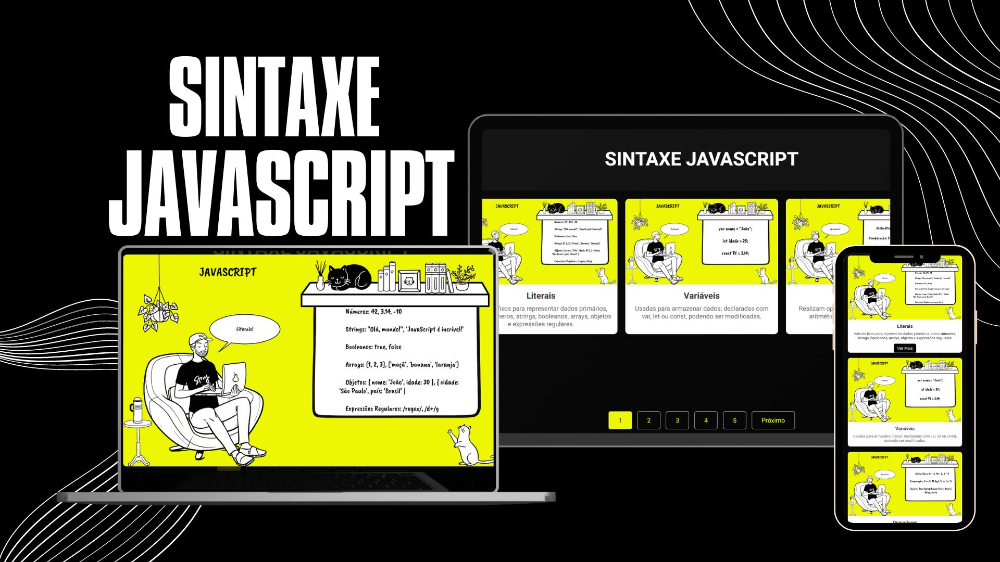

# 📚 Paginação e Modal com HTML, CSS e JavaScript




O projeto de **paginação** e **modal** interativo, desenvolvido com **HTML**, **CSS** e **JavaScript**. Este projeto demonstra como implementar uma interface de usuário elegante e funcional para visualizar e navegar por uma lista de itens com capacidade de expansão de texto e visualização de imagens em modal.

## 🚀 Recursos

- **Paginação Dinâmica**: Navegue facilmente entre diferentes páginas de itens com botões de navegação.
- **Modal Interativo**: Amplie e visualize imagens em um modal com efeito de zoom.
- **Expansão de Texto**: Expanda ou contraia descrições adicionais dos itens com um clique.
- **Design Responsivo**: Layout otimizado para diferentes tamanhos de tela.

## 🎨 Layout e Estilo

- **Design Limpo e Moderno**: Usamos uma paleta de cores sóbria e moderna com uma fonte legível para uma ótima experiência de usuário.
- **Animações Elegantes**: Transições suaves para interações como clique, hover e visualização de modais.

## 📦 Instalação

Para executar este projeto localmente, siga estas etapas:

1. **Clone o Repositório**

   ```bash
   git clone https://github.com/usuario/repositorio.git
   ```
2. **Acesse o Diretório do Projeto**

   ```bash
   cd repositorio
   ```
3. **Abra o Arquivo HTML no Navegador**

   Simplesmente abra o arquivo `index.html` em seu navegador preferido.

## 🛠️ Estrutura do Projeto

- **index.html**: O arquivo principal que contém a estrutura HTML.
- **styles.css**: Arquivo de estilos para o design e layout.
- **script.js**: Contém a lógica para a navegação, modais e interações.
- **expand.js**: Funções adicionais para expansão de texto e outros comportamentos.

## 🖼️ Como Funciona

1. **Paginação**: Os itens são divididos em páginas. Você pode navegar entre páginas usando os botões "Anterior" e "Próximo".
2. **Modal**: Clique em uma imagem para abrir o modal com um efeito de zoom. Clique no botão de fechar (X) para fechar o modal.
3. **Expansão de Texto**: Clique no botão "Ver Mais" para expandir ou contrair a descrição dos itens.

## 💻 Tecnologia

- **HTML5**: Estrutura e conteúdo da página.
- **CSS3**: Estilos e animações.
- **JavaScript**: Interatividade e lógica dinâmica.

## 📱 Responsividade

O projeto é responsivo e otimizado para dispositivos móveis. Os cartões e botões se ajustam automaticamente a diferentes tamanhos de tela.

## 🤝 Contribuição

Se você deseja contribuir para este projeto, siga as etapas abaixo:

1. **Faça um Fork do Repositório**
2. **Crie uma Branch para suas Alterações**

   ```bash
   git checkout -b minha-nova-feature
   ```
3. **Faça as Alterações Necessárias e Commit**

   ```bash
   git commit -am 'Adicionei uma nova feature'
   ```
4. **Envie para o Repositório Remoto**

   ```bash
   git push origin minha-nova-feature
   ```
5. **Abra um Pull Request**

   Descreva suas alterações e envie para revisão.

## 📜 Licença

Este projeto está licenciado sob a [MIT License](LICENSE). Veja o arquivo LICENSE para mais detalhes.

## 📧 Contato

Para perguntas ou comentários, sinta-se à vontade para entrar em contato:

- **Email**: developer.thomas@outlook.com.br
- **GitHub**: devthm
